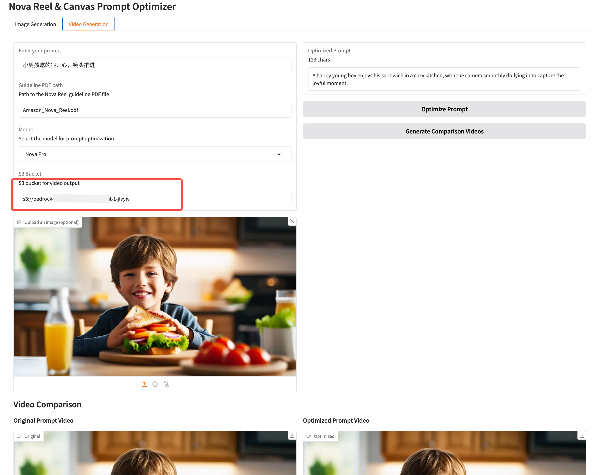
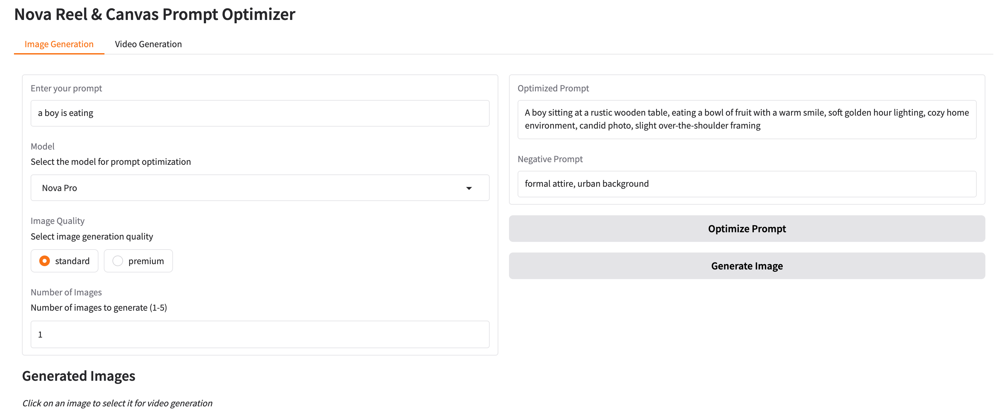
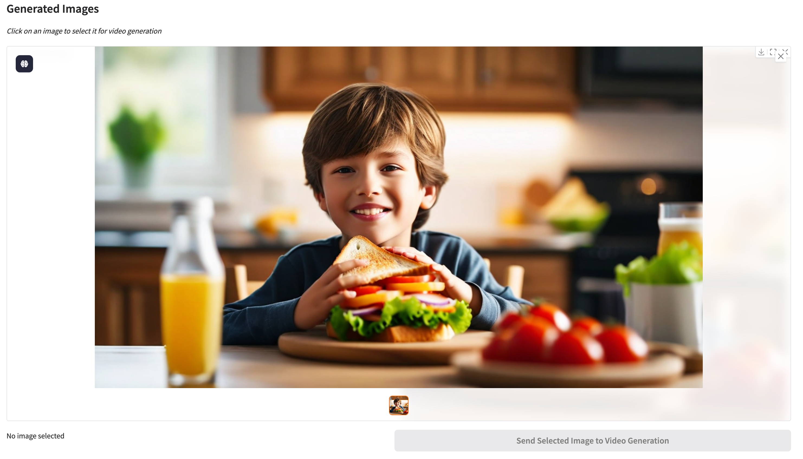
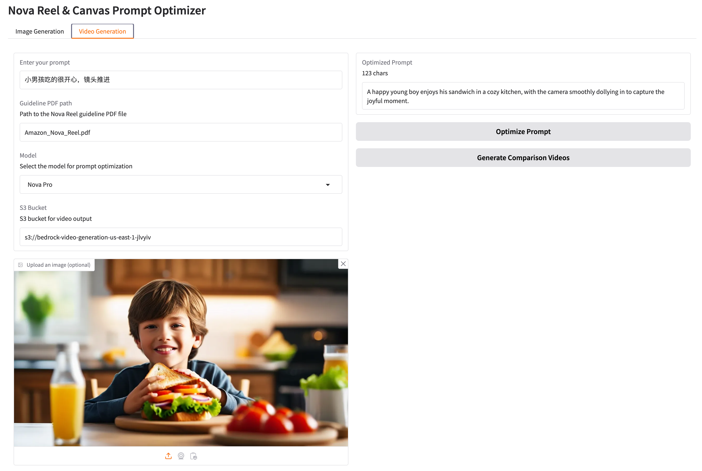
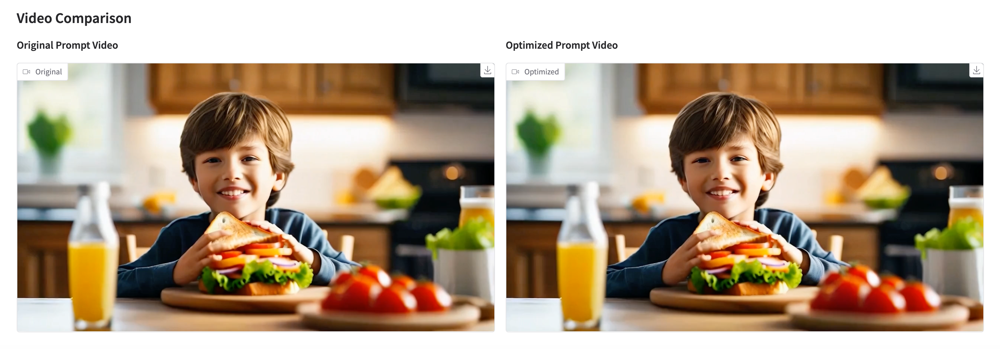
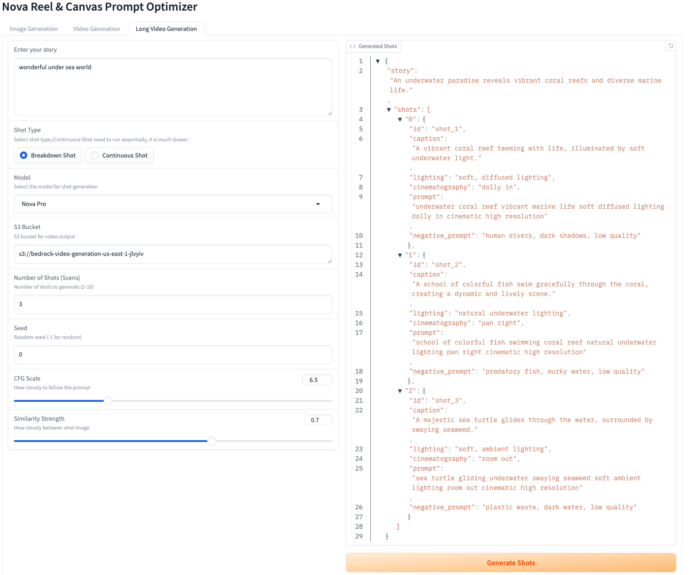
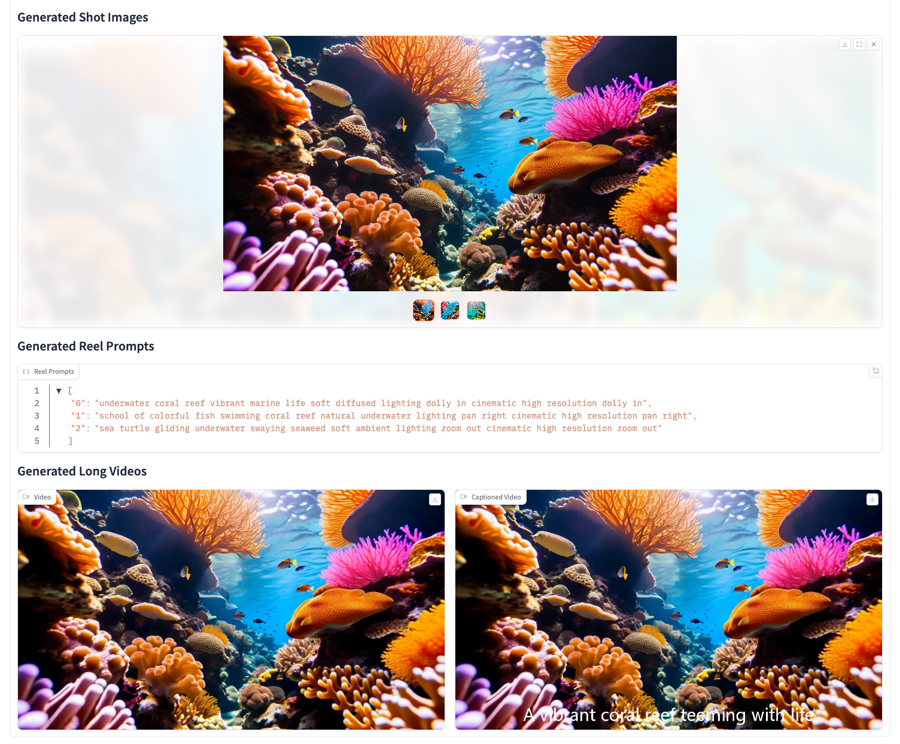

# Nova Reel Prompt Optimizer

A Gradio web interface for optimizing prompts and generating videos using Amazon's Nova [Canvas and Reel model](https://docs.aws.amazon.com/nova/latest/userguide/content-generation.html).

## Update Logs
### 12/30/2024
- Add Long Video Generation.  
Expand an input from the user, generate a storyboard, create breakdown shots, and generate a long video
* 1. ```Prompt:我心目中的AWS像一柄利剑，帮我在数字化转型的道路上披荆斩棘。``` [video demo1 file](assets/aws_stitched_1_caption.mp4)
- 

* 2. ```Prompt:wonderful under sea world``` [video demo2 file](assets/4p6jvyq58l7q_stitched_1_caption.mp4) 
- 


example:
### 1/6/2025
- Add QR Code generation for long video. The viewers can download the artifacts in their phone

### 12/23/2024
- Add seed, cfg scale, Aspect ratio
- Add option to enable/disable comparison mode 

## Features
- Text prompt optimization for Nova Canvas image generation
- Text prompt optimization for Nova Reel video generation
- 1-click automatically optimize any languages & any prompts, with the reference of Nova official guideline.
- 1-click to copy the generated image from Canvas to for Reel video generation
- Real-time prompt optimization using Nova
- Comparison Videos generation from original prompt and optimized prompt
- User-friendly web interface

## Prerequisites

- Python 3.10+
- AWS credentials configured with access to Bedrock and S3
- An S3 bucket for video output (You can copy the default bucket created from Nova Reel when you first time play with it in Bedrock Console)

## Installation

1. Install the required Python packages:

```bash
pip install -r requirements.txt
```

2. Make sure you have AWS credentials configured with appropriate permissions for:
   - Amazon Nova Pro/Lite/Canvas and Reel
   - S3 bucket access

3. Update the S3 bucket name in WebUI or you can change it in `config.py` `DEFAULT_BUCKET=`:


## Usage
1. Start the Gradio interface:

```bash
python app.py
```

2. Open your web browser and navigate to the URL shown in the terminal (typically http://127.0.0.1:7860)

3. Image generation

   - Enter your prompt in the text box
   - Click "Optimze Prompt" to start the create Optimized Prompt and Negative Prompt (If needed)
   - Click "Generate Image" to start the create images
   - View the optimized prompt and generated images
   - 1-click to copy the image to Video generation


4. Video generation

   - Enter your prompt in the text box
   - Optionally upload an image or 1-click copy from Image generation
   - Click "Optimze Prompt" to start the create Optimized Prompt and Negative Prompt (If needed)
   - Click "Generate Image" to start the create image
   - View the optimized prompt and generated video
   - You can compare the videos between original and optimized version


5. Long video generation
   - Enter your prompt in the story box
   - Click "Generate Shots" to create storyboard.
   - Click "Generate Video" to generate a long video.   
    It first creates images by scens, generate videos from every image of the scen, then concate the short videos to a long video, add caption to the video
   
   
s
## Notes

- The application uses Amazon Nova to optimize prompts for better video generation results
- I found sometimes that `Nova Pro` works better for image optimzation while `Nova Lite` works better for video, so you can switch the model to try. 
- Video generation may take several minutes to complete
- Generated videos are temporarily stored in the `generated_videos` directory
- Generated images are temporarily stored in the `generated_images` directory
- Both English and Chinese prompts are supported, but optimized prompts will be in English

## Example Prompts

### Text to Image example:
```
海底漫游的视频
```
```
a video of walking in a underwater world
```   


